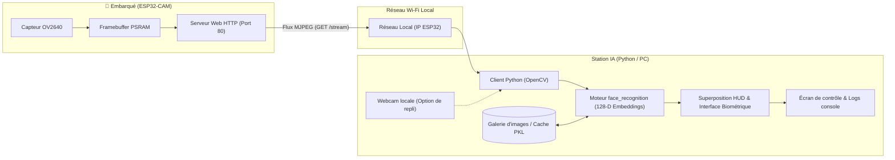

# ESP32-CAM — Reconnaissance Faciale & Contrôle d'Accès Biométrique


---

## Présentation du Projet

Le projet **ESP32-CAM-Reconnaissance** est une solution complète de **vidéosurveillance intelligente et de contrôle d'accès biométrique en temps réel**, alliant l'Internet des Objets (IoT) et la vision par ordinateur (Deep Learning).

### Problématique & Philosophie d'Architecture

Les microcontrôleurs compacts comme l'**ESP32-CAM** disposent de ressources de calcul et de mémoire limitées (PSRAM), ce qui rend l'exécution de modèles neuronaux complexes de reconnaissance faciale difficile et lente en local.

Pour contourner cette contrainte matérielle, le projet adopte une **architecture déportée (Edge-to-Host)** :

1. **Côté Embarqué (ESP32-CAM)** : Le microcontrôleur capture les images via son capteur OV2640, optimise le traitement matériel (gestion du buffer, qualité JPEG) et diffuse un flux vidéo continu **MJPEG via un serveur HTTP Wi-Fi**.
2. **Côté Traitement (Poste de contrôle / PC)** : Un client Python multithreadé récupère le flux réseau, décode les trames et applique les algorithmes de pointe de détection de visages (HOG / CNN) et d'extraction de vecteurs biométriques (128 descripteurs uniques par visage via `face_recognition` et `OpenCV`).
3. **Affichage & Décision** : Le système compare instantanément les visages détectés à une base d'identités locale, applique un affichage dynamique augmenté (HUD haute précision pour les profils VIP/Alumni) et consigne les autorisations d'accès.



---

## Arborescence Complète du Projet

Voici l'organisation détaillée de l'ensemble du dépôt :

```text
ESP32-CAM-Reconnaissance/
│
├── README.md                              ← Présentation générale et vue d'ensemble du projet
│
└── Arduino/                               ← Espace de développement microcontrôleur & scripts
    │
    ├── ESP32_FaceRecog/                   ← Cœur applicatif du système de reconnaissance
    │   ├── ESP32_FaceRecog.ino            ← Firmware C++ pour ESP32-CAM (Wi-Fi, caméra, serveur MJPEG)
    │   ├── face_recognition_client.py     ← Application Python de vision par ordinateur & reconnaissance
    │   ├── requirements.txt               ← Dépendances Python nécessaires (opencv, face-recognition, numpy...)
    │   ├── README.md                      ← Documentation technique détaillée du module de reconnaissance
    │   ├── README_INSTALLATION.md         ← Guide pas-à-pas d'installation de dlib et de l'environnement Python
    │   │
    │   ├── images/                        ← Base de données des visages de référence
    │   │
    │   ├── face_encodings.pkl             ← Cache binaire des signatures faciales (généré au 1er lancement)
    │   ├── venv/                          ← Environnement virtuel Python local (recommandé)
    │   └── __pycache__/                   ← Fichiers de bytecode Python compilés
    │
    └── libraries/                         ← Bibliothèques matérielles Arduino pour extensions
        ├── Adafruit_Unified_Sensor/       ← Pilote unifié pour capteurs Adafruit
        ├── DHT_sensor_library/            ← Gestion des capteurs d'humidité et de température DHT11/DHT22
        ├── ESP32Servo/                    ← Contrôle précis de servomoteurs adapté aux timers ESP32
        └── Servo/                         ← Bibliothèque servo standard
```

---

## Fonctionnalités Principales

| Fonctionnalité                   | Description                                                                                                                                                  |
| :------------------------------- | :----------------------------------------------------------------------------------------------------------------------------------------------------------- |
| **Diffusion Sans Fil Optimisée** | Serveur web HTTP intégré avec gestion anti-freeze du buffer d'image (`CAMERA_GRAB_LATEST`, double buffer en PSRAM).                                          |
| **Reconnaissance 128-D**         | Extraction de signatures vectorielles faciales robustes aux variations d'éclairage, d'angle et d'expression.                                                 |
| **Système de Cache Rapide**      | Sérialisation automatique des empreintes dans `face_encodings.pkl` évitant le recalcul à chaque redémarrage.                                                 |
| **Interface HUD Futuriste**      | Rendu graphique type "Cyberpunk/Biométrique" : viseurs aux coins du visage, badges lumineux et panneaux d'informations détaillées pour les profils spéciaux. |
| **Mode Hybride / Fallback**      | Possibilité de basculer instantanément entre le flux réseau de l'ESP32-CAM et la webcam intégrée du PC (`ESP32_CAM_URL = None`).                             |
| **Optimisation Anti-Lag**        | Détection exécutée une image sur $N$ à échelle réduite pour maintenir un affichage fluide à 30+ FPS.                                                         |

---

## Démarrage Rapide

### 1. Flasher l'ESP32-CAM

1. Ouvrir le fichier [`ESP32_FaceRecog.ino`](file:///Arduino/ESP32_FaceRecog/ESP32_FaceRecog.ino) dans **Arduino IDE**.
2. Dans `Outils` :
   - Type de carte : `AI Thinker ESP32-CAM`
   - Partition Scheme : `Huge APP (3MB No OTA / 1MB SPIFFS)`
   - PSRAM : `Enabled`
3. Ajuster les identifiants Wi-Fi aux lignes 26-27 (`ssid` et `password`).
4. Relier la broche **IO0 à GND** lors du branchement pour basculer en mode téléversement, puis flasher.
5. Retirer le pont IO0-GND, ouvrir le moniteur série (115200 bauds) et noter l'adresse IP affichée (ex: `http://192.168.1.42`).

### 2. Configurer le Client Python

1. Se positionner dans le dossier applicatif :
   ```powershell
   cd Arduino/ESP32_FaceRecog
   ```
2. Installer les bibliothèques requises :
   ```powershell
   pip install -r requirements.txt
   ```
   _(Pour Windows, si vous rencontrez des difficultés avec `dlib`, consultez le guide complet [`README_INSTALLATION.md`](file:///Arduino/ESP32_FaceRecog/README_INSTALLATION.md))._
3. Renseigner l'adresse IP de votre carte dans [`face_recognition_client.py`](file:///Arduino/ESP32_FaceRecog/face_recognition_client.py) :
   ```python
   ESP32_CAM_URL = "http://192.168.1.42/stream"  # Ou None pour utiliser la webcam locale
   ```

### 3. Exécuter la Reconnaissance

Lancer le script de reconnaissance :

```powershell
python face_recognition_client.py
```

- Appuyer sur **`q`** dans la fenêtre vidéo pour quitter l'application.

---

## Gestion des Profils & Personnalisation

- **Ajouter une personne** : Déposez une photo claire du visage dans le dossier `Arduino/ESP32_FaceRecog/images/` au format `.png` ou `.jpg` (ex : `Prenom Nom.png`). Supprimez le fichier `face_encodings.pkl` s'il existe pour forcer la mise à jour de la base.
- **Ajouter une fiche HUD enrichie (VIP/Alumni)** : Modifiez le dictionnaire `SPECIAL_PROFILES` dans [`face_recognition_client.py`](file:///Arduino/ESP32_FaceRecog/face_recognition_client.py) pour ajouter des métadonnées (statut, formation, rôle, niveau d'accès).

---

## Schéma de Câblage pour le Flash (FTDI / USB-UART)

L'ESP32-CAM ne possédant pas de convertisseur série USB natif, utilisez un adaptateur série FTDI / CH340 :

| Adaptateur FTDI / Série | ESP32-CAM        | Remarques                                                  |
| :---------------------- | :--------------- | :--------------------------------------------------------- |
| **VCC (5V)**            | **5V**           | Alimentation recommandée en 5V (minimum 1A stable)         |
| **GND**                 | **GND**          | Masse commune                                              |
| **TXD**                 | **U0R (GPIO 3)** | Réception série                                            |
| **RXD**                 | **U0T (GPIO 1)** | Transmission série                                         |
| _(Pont amovible)_       | **IO0 ↔ GND**    | **Indispensable pour le mode flash (à déconnecter après)** |

---

## Licences & Documentation Supplémentaire

- Documentation détaillée du client et des réglages caméra : [Arduino/ESP32_FaceRecog/README.md](file:///Arduino/ESP32_FaceRecog/README.md)
- Guide d'installation complet sous Windows (dlib / CMake / Visual Studio) : [Arduino/ESP32_FaceRecog/README_INSTALLATION.md](file:///Arduino/ESP32_FaceRecog/README_INSTALLATION.md)
